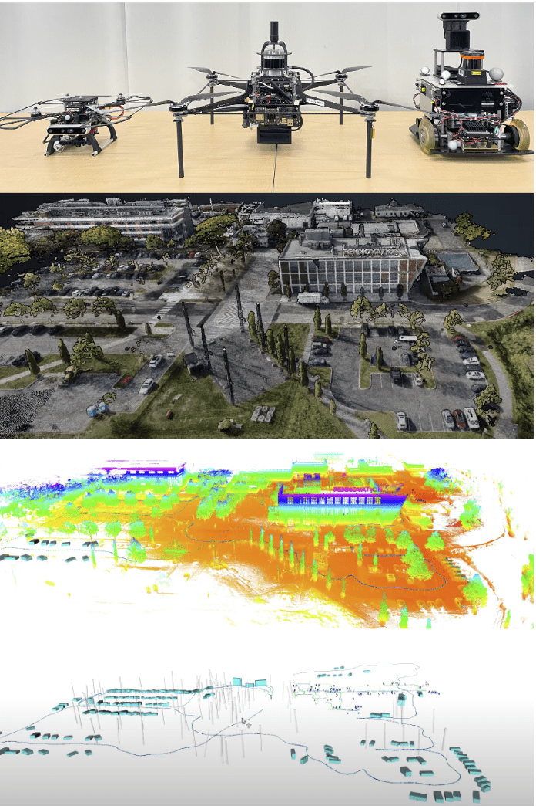

- Developed a versatile metric-semantic SLAM framework for autonomous UAVs and UGVs to address challenges in collaborative SLAM for heterogeneous robots with varied perception modalities, large pose graph computational burdens, and semantic environment understanding by using sparse object-level features with semantic information to enhance localization and mapping.
- Introduced a loop closure algorithm considering global object layout information for drift correction and map merging
between robots
- Integrated the framework into the autonomy stack of ground robots, and conducted extensive experiments, including
using a quadrotor for outdoor mapping and ground robots for exploration of a building.

[Video is available here](https://drive.google.com/file/d/13pq96vJ-9ApS_JO_fIS_C1X7AZ9kL_yV/view?usp=drive_link)
