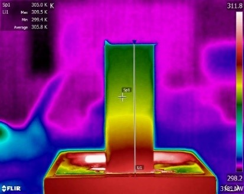

**Abstract:** On the basis of heat transfer experiment teaching in undergraduate education, this project tends to establish an innovative research experiment with the help of infrared thermal imager which is characterized by its intuitional observation, high measuring speed and contactless measurement.  Additionally, the project would help construct a teaching model covering "thermal conduction and thermal radiation". Moreover, this new experiment project could help students to grasp the application of a kind of advanced equipment - infrared thermal imager, learn to analyze infrared images and get familiar with self-designed research experiments, meanwhile, it would improve students’ practical ability of engineering.

Established an experiment teaching model for heat conduction and heat radiation using infrared imagers. Designed the experiment to find the relationship between temperature and thermal radiation intensity by collecting thermal images of different materials under different temperatures.

