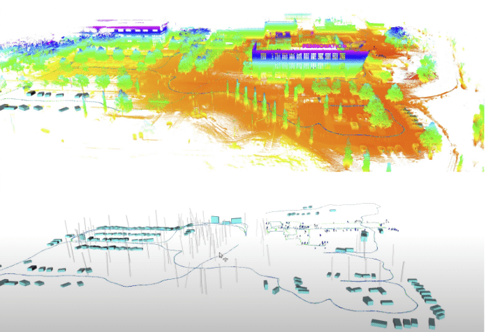

**Abstract:**In this paper, we propose a generic and versatile
metric-semantic SLAM (MS-SLAM) framework for autonomous
exploration with heterogeneous robot teams. The proposed MS-
SLAM framework supports different types of sensors including
LiDARs and RGBD cameras. It enables a heterogeneous team
of robots to autonomously explore 3D environments featuring
both indoor and outdoor areas without relying on GPS. The
MS-SLAM framework utilizes a hierarchical metric-semantic
representation of the environment, ranging from high-level sparse
maps to low-level dense maps.For the purpose of facilitating
autonomous large-scale exploration and navigation, we choose
a high-level map representation that is sparse and semantically
meaningful, consisting of explicitly modeled object landmarks.
Building upon such a representation, we use our customized
measurement models for each type of semantic objects and
incorporate them into a factor graph, so that the robot can
efficiently optimize over the semantic map and its poses during
the entire mission. We propose a novel semantic place recognition
algorithm that utilizes the high-level semantic map to detect
both intra-robot and inter-robot loop closures, and estimate
relative transformations. We design a multi-robot collaboration
framework that keeps track of metric-semantic observations that
can be efficiently shared to facilitate decentralized collaborative
MS-SLAM. Due to the sparsity and informativeness of the high-
level semantic map, our system runs in real time on each
robot in a decentralized manner and opportunistically leverages
communication. We integrate and deploy our proposed MS-
SLAM framework on three types of aerial and ground robots
that utilize either RGBD cameras or LiDARs, and demonstrate
that the team of robots can explore a 3D large-scale indoor-
outdoor environment. We show, through both theoretical analysis
and empirical evidence, that our proposed MS-SLAM has low
computational and memory demand even with large teams
of robots autonomously exploring large-scale environments. In
addition, we benchmark our system against state of the art
metric-semantic SLAM algorithms, as well as evaulate it on a
public dataset.

[Video is available here](https://drive.google.com/file/d/13pq96vJ-9ApS_JO_fIS_C1X7AZ9kL_yV/view?usp=drive_link)
